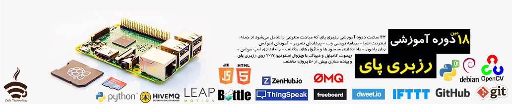

# rpi-course
Raspberry Pi course projects

This repository contains all projects of Raspberry Pi course which performed in each session.
The Raspberry Pi course are held in iran at cafe technology.
More about the course: https://evnd.co/JYgii

Run "Prerequisites.sh" on raspbian for install all prerequisites library.

Regards.

## Contributors
Special thanks to [FSZolfaghari](https://github.com/FSZolfaghari) for developing test cases of python practices.
